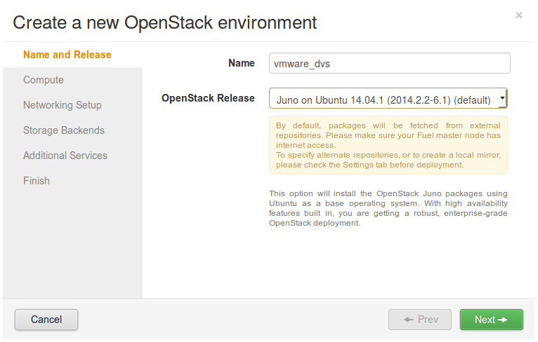
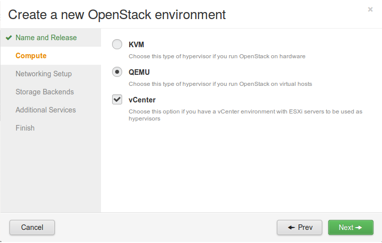
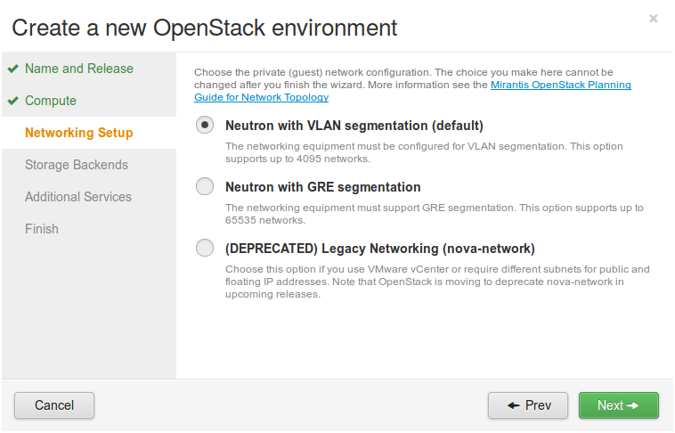
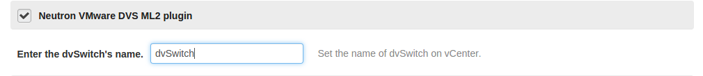
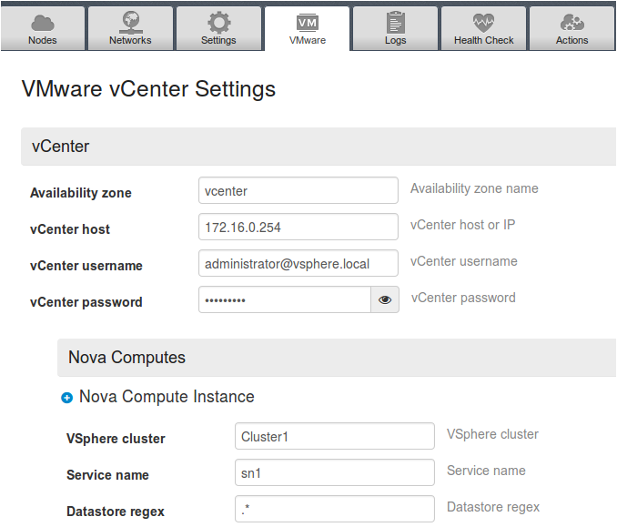
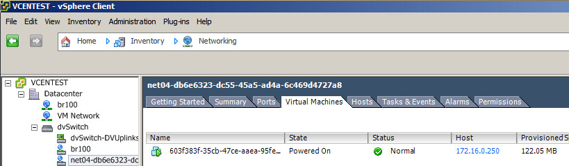
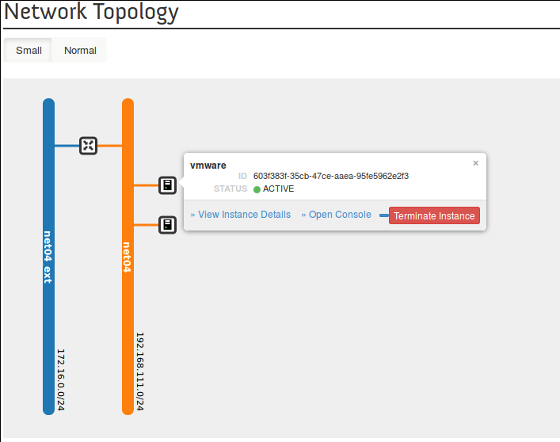

The VMware DVS plugin for Fuel 6.1 installation guide
======================================================

Revision history
----------------

+--------+----------------+------------------------+---------------------------+
|Version | Revision date  | Editor                 | Comment                   |
+========+================+========================+===========================+
| 0.1    | 09.01.2015     | Igor Gajsin            | Created the first version.|
|        |                | (igajsin@mirantis.com) |                           |
+--------+----------------+------------------------+---------------------------+

Document purpose
----------------

The purpose of this document is to describe how to install, configure
and use the VMware DVS plugin for Fuel 6.1.

Key terms, acronyms and abberviations
-------------------------------------

============================= ========================================================
**Term/acronym/abbreviation** **Definition**
============================= ========================================================
VM                            Virtual Machine
MOS                           Mirantis OpenStack
OVS                           Open vSwitch
Neutron ML2 plugin            The Neutron Modular Layer 2 plugin is a framework
                              allowing OpenStack Networking to simultaneously
			      utilize the variety of layer 2 networking technologies
vmware_dvs driver             The driver in the Neutron ML2 plugin which provides
                              interaction with dvSwitch on vCenter
VMware DVS plugin             The plugin for Fuel which installs and configures
                              vmware_dvs driver on a MOS environment
dvSwitch                      distributed vSwitch on VMware ESXi
VMware ESXi                   bare-metal hypervisor
VMware vCenter Server         Central control point for VMware vSphere
VMware vSphere                VMware’s cloud computing virtualization operating
                              system.
============================= ========================================================

The VMware DVS plugin
---------------------

MOS supports using vCenter as a hypervisor in a vCenter-only or
heterogeneous, mixed with KVM environments. There is the vmware\_dvs
driver for Neutron ML2 plugin which provides usage Neutron for
networking in such environments. Thereby environments receives an
advanced network features:

-  Ability to create multi-tier networks (e.g., web tier, db tier, app
   tier).

-  Control over IP addressing.

-  Ability to insert an configure their own services (e.g., firewall,
   IPS)

-  VPN/Bridge to remote physical hosting or customer premises.

Licensing information
---------------------

================= ============
**Component**     **License**
vmware_dvs driver Apache 2.0
VMware DVS plugin Apache 2.0
================= ============

Assumptions and limitations
---------------------------

Assumptions
-----------

#. dvSwitch must be provisioned by using vCenter firstly and manually.

#. There must be a mapping between physical network and dvSwitch:

   #. different physnet to different dvSwitch (i.e. physnet1:dvswitch1, physnet2:dvswitch2),

   #. different physnet to the same dvSwitch(i.e. physnet1:dvswitch1, physnet2:dvswitch1).

#. VLANs will be used as a tenant network separation by KVM’s OVS and
   ESXi’s dvSwitch (must be the same for tenant network regardless which
   switch type OVS or dvSwitch)

#. There must be an ability to:

   #. create / terminate a port group on dvSwitch

   #. bind port from such port group to a VM

   #. disable state of the neutron port group or port on dvSwitch

   #. assign multiple vNIC to a single VM deployed on ESXi

#. Name of driver is vmware\_dvs

#. Plugin supports addition controller-nodes after deploy.

#. Plugin has to carry with it code of vmware\_dvs and all their
   dependencies to be independent from network’s conditionals when
   install.

Limitations
-----------

-  VMware DVS plugin be enabled only in environments with Neutron as the
   networking option.

-  Only VLANs are supported for tenant network separation (VxLAN support
   can be added later, if project will be continued).

-  Only vSphere 5.5 is supported

Requirements
------------

The plugin has the following requirements for software

================  ===========
**Requirements**  **Version**
 Fuel             6.1
 vCenter          5.5
================  ===========

Installation Guide
------------------

Prerequisites
-------------

This guide assumes that you have installed Fuel and all the nodes of
your future environment are discovered and functional. Note, that you
need to have a connectivity to correctly configured vCenter with
precreated dvSwitch and clusters.

Obtaining the VMware DVS plugin
-------------------------------

You can download it from `Fuel Plugins
Catalog <https://www.mirantis.com/products/openstack-drivers-and-plugins/fuel-plugins/>`__
or build from the `github
repositories <https://github.com/stackforge/fuel-plugin-vmware-dvs>`__
via some steps:

#. Create and activate a virtual environment:
   ::

   $ virtualenv fpb
   $ . fpb/bin/activate

#. Install the fuel plugin builder:
   ::

      (fpb) user@host:/path$ pip install
      fuel-plugin-builder

#. Get plugin sources from github.
   ::

      (fpb) user@host:/path$ git clone
      https://github.com/stackforge/fuel-plugin-vmware-dvs.git

#. Patch the template file in the fuel plugin builder
   ::

      (fpb) user@host:/path$ patch fpb/lib/python2.7/site-packages/fuel_plugin_builder/
      /templates/build/plugin_rpm.spec.mako  fuel-plugin-vmware-dvs/hack.diff

#. Build the plugin
   ::

      (fpb) user@host:/path$ fpb --build fuel-plugin-vmware-dvs
      Plugin is built

#. Put the plugin into Fuel Master node
   ::

      $ scp fuel-plugin-vmware-dvs-1.0-1.0.1-1.noarch.rpm <Fuel Master node ip>:/tmp

#. Login to the Fuel Master node and install the plugin:
   ::

      $ ssh root@<Fuel Master node ip>
      [root@nailgun ~]# fuel plugins --install /tmp/fuel-plugin-vmware-dvs-1.01.0.11.noarch.rpm
      [root@nailgun  ]# fuel plugins
      DEPRECATION WARNING: /etc/fuel/client/config.yaml exists and will
      be used as the source for settings. This behavior is deprecated.
      Please specify the path to your custom settings file in the
      FUELCLIENT_CUSTOM_SETTINGS environment variable.

      +------+--------------------------+-----------+--------------------+
      | id   | name                     | version   | package\_version   |
      +------+--------------------------+-----------+--------------------+
      | 2    | fuel-plugin-vmware-dvs   | 1.0.1     | 2.0.0              |
      +------+--------------------------+-----------+--------------------+

Removing the VMware DVS plugin
------------------------------

To uninstall VMware DVS plugin, follow these steps:

#. Delete all Environments in which VMware DVS plugin has been enabled.

#. Uninstall the plugin:
   ::

      # fuel plugins --remove fuel-plugin-vmware-dvs--1.0.1

#. Check if the plugin was uninstalled successfully:
   ::

      +------+--------+-----------+--------------------+
      | id   | name   | version   | package_version    |
      +------+--------+-----------+--------------------+
      +------+--------+-----------+--------------------+

Configuring VMware DVS plugin
-----------------------------

#. `Create a new OpenStack
   environment <https://docs.mirantis.com/openstack/fuel/fuel-6.1/user-guide.html#create-a-new-openstack-environment>`__
   with Fuel UI wizard

2. Please set vCenter checkbox on choosing compute’s type step.

3. Please select Neutron with VLAN segmentation network model, which is
   the only network type supported with VMware DVS plugin

4. There are no limitations on other steps in the wizard.

5. Add at least 1 Controller and 1 Compute node to the environment.

6. Turn on the plugin usage checkbox and set correct name of dvSwitch in
   the Settings tab.

7. Fill the vmware configuration fields on the VMware tab.

The rest configuration is up to you. See `Mirantis OpenStack User Guide
<https://docs.mirantis.com/openstack/fuel/fuel-6.1/user-guide.html>`__
for instructions to configure other options.

8. Click “Deploy changes” to deploy the environment.

Usage Guide
-----------

Once OpenStack has been deployed, we can start using Neutron for
networking. The net04 port group should appear on the vCenter:

Network topology on Horizon should looks like:

where vmware is an instace located on the vCenter.

You can use Neutron for such instance totally same way as for KVM
located instances.
