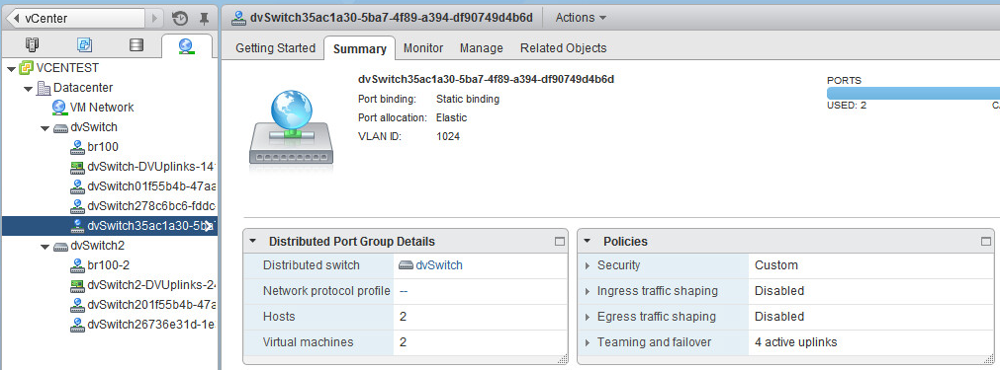
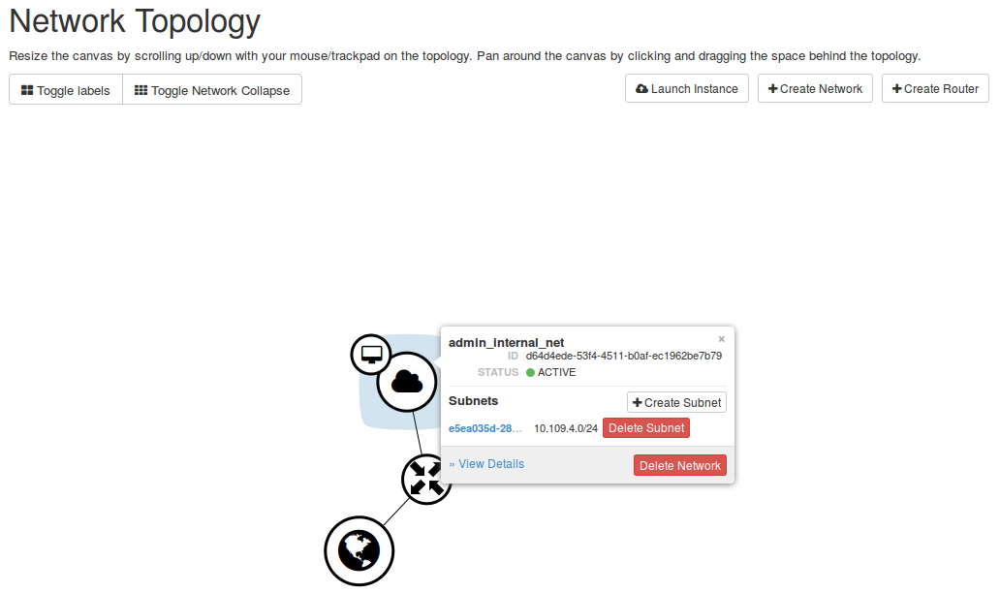

Using advanced Neutron possibilities with VMware DVS plugin
-----------------------------------------------------------

This section describes the features that you get while using the VMware DVS
plugin as well as outlines the usage aspects of DVS security groups.

Once you deploy an OpenStack environment with VMware DVS plugin, you can
start using Neutron for networking.

The port group for ``admin_internal_net`` is created on clusters when VMs
are attached:

.. raw:: latex

   \pagebreak

|

In Horizon, the network topology looks as follows:

where *VMware* is the name of the instance located in vCenter. You can use
Neutron for such instance the same way as for KVM-located instances.

.. TODO OL: Update the picture so that it displays the instance name
   as mentioned in description.

**DVS security groups**

The functionality of the VMWare DVS plugin security groups differs from the
KVM implementation:

* The VMWare DVS plugin does not support stateful firewall properties and
  ICMP types. It realizes the emulation logic to support similar
  behavior. The plugin installs a reverse traffic rule for each security group
  rule.
* The VMWare DVS plugin state emulation logic uses ephemeral port range filter
  to rise the security of reverse rules implementation.

You can only add the reverse rules to correctly launch an EC2-compatible
image with metadata request and DNS access.

**To add reverse rules:**

#. Implement a custom TCP egress rule to 169.254.169.254//32 CIDR port 80.
#. Implement a custom UDP egress rule to <DNS server IP or 0.0.0.0//0>
   CIDR port 53.

The VMWare DVS plugin installs four rules:

#. TCP egress from any IP ports 32768-65535 to metadata IP port 80

#. TCP ingress from metadata IP port 80 to any IP ports 32768-65535

#. UDP egress from any IP ports 32768-65535 to DNS IP port 53

#. UDP ingress from DNS IP port 53 to any IP ports 32768-65535

.. note:: 32768-65535 is a useful ephemeral port range for most Linux kernels
   and Windows hosts.

Example of a common egress TCP rule:

* TCP egress to any ports 0.0.0.0/0 CIDR

It works as follows:

* TCP egress from any IP ports 32768-65535 to any IP any port
* TCP ingress from any IP any port to any IP ports 32768-65535

Once applied, the private ports of your VM like HTTP or SSH will be closed.

The VMWare DVS plugin supports only symmetric ICMP interaction. If your host
can ping a destination host, it means that the destination host can ping your
host by reverse rules.

.. raw:: latex

   \pagebreak
